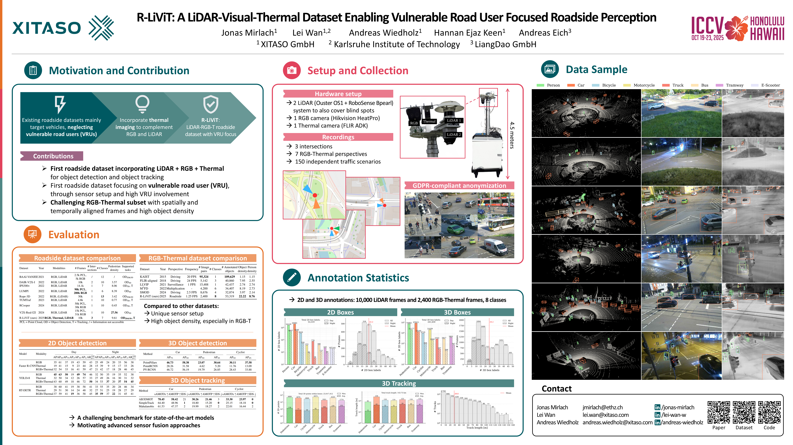

# R-LiViT: A LiDAR-Visual-Thermal Dataset for Enhanced Roadside Perception of Vulnerable Road Users

[](https://doi.org/10.48550/arXiv.2503.17122)
[](https://arxiv.org/abs/2503.17122)
[](https://doi.org/10.5281/zenodo.16356714)

R-LiViT is a comprehensive dataset designed to enhance roadside perception systems, focusing on vulnerable road users.

This repository allows you to reproduce the experiments and benchmarking from the paper:
> **R-LiViT: A LiDAR-Visual-Thermal Dataset for Enhanced Roadside Perception of Vulnerable Road Users** \
> *IEEE/CVF International Conference on Computer Vision (ICCV), 2025*\
> [https://doi.org/10.48550/arXiv.2503.17122](https://doi.org/10.48550/arXiv.2503.17122) 


Additionally, the pipelines include **dataloading tools** and can be used for **further experiments**, see READMEs in the subfolders.




## 📦 Data Download

You can download the dataset via Zenodo: [https://doi.org/10.5281/zenodo.16356714](https://doi.org/10.5281/zenodo.16356714)

There are three downloadable versions (direct download by clicking on the link):
- [LiDAR + RGB-T](https://zenodo.org/records/16356714/files/R-LiViT.zip?download=1)
- [LiDAR](https://zenodo.org/records/16356714/files/R-LiViT_LiDAR.zip?download=1)
- [RGB-T](https://zenodo.org/records/16356714/files/R-LiViT_RGB-T.zip?download=1)

## 📊 Evaluation Results

### LiDAR 
To reproduce the LiDAR results refer to the `lidar_object_detection_and_tracking/` folder and its `README.md` file.

<details>
<summary><b>LiDAR Object Detection Benchmark Results</b></summary>

| Method       | AP<sub>75</sub> | AP<sub>50</sub> | AP<sub>75</sub> | AP<sub>25</sub> | AP<sub>50</sub> | AP<sub>25</sub> |
|---------------|--------------------|--------------------|--------------------|--------------------|--------------------|--------------------|
|               | (Car)    | (Car)   | (Pedestrian) | (Pedestrian) | (Cyclist)  | (Cyclist)  |
| PointPillars  | **46.73**              | **58.38**          | **23.07**          | **30.64**          | **30.11**          | **37.58**          |
| PointRCNN     | 28.26              | 31.58              | 4.62               | 5.20               | 11.76              | 13.09              |
| PV-RCNN       | 46.72          | 56.19              | 19.79              | 26.85              | 28.43              | 33.88              |

</details>

<details>
<summary><b>LiDAR Multi Object Tracking Benchmarking Results</b></summary>

| Method      | sAMOTA ↑ | AMOTP ↑ | IDS ↓ | sAMOTA ↑ | AMOTP ↑ | IDS ↓ | sAMOTA ↑ | AMOTP ↑ | IDS ↓ |
|-------------|----------|---------|-------|----------|---------|-------|----------|---------|-------|
|             | (Car)    | (Car)   | (Car) | (Pedestrian) | (Pedestrian) | (Pedestrian) | (Cyclist)  | (Cyclist)  | (Cyclist)  |
| AB3DMOT     | **78.45**| **58.42**| 21    | **30.26** | **21.46** | 3     | **33.30** | **23.97** | **0**     |
| SimpleTrack | 64.40    | 48.96   | **1** | 18.80    | 15.20   | **0** | 25.15    | 18.18   | **0** |
| Mahalanobis | 61.53    | 47.37   | 2     | 19.99    | 18.27   | 2     | 22.01    | 16.44   | 2     |

</details>

### RGB-T
To reproduce the RGB-T results refer to the `rgbt_object_detection/` folder and its `README.md` file.

<details>
<summary><b>RGB-T Object Detection Benchmarking Results</b></summary>

| Model           | Modality     | AP    | AP<sub>50</sub> | AP<sub>75</sub> | AP<sub>S</sub> | AP<sub>M</sub> | AP<sub>L</sub> | AR<sub>per</sub><sup>100</sup> | AP    | AP<sub>50</sub> | AP<sub>75</sub> | AP<sub>S</sub> | AP<sub>M</sub> | AP<sub>L</sub> | AR<sub>per</sub><sup>100</sup> |
|-----------------|--------------|-------|-----------------|-----------------|----------------|----------------|----------------|--------------------------------|-------|-----------------|-----------------|----------------|----------------|----------------|--------------------------------|
|                 |              | (Day) | (Day)           | (Day)           | (Day)          | (Day)          | (Day)          | (Day)                          | (Night) | (Night)         | (Night)         | (Night)        | (Night)        | (Night)        | (Night)                        |
| Faster R-CNN    | RGB          | 35.06 | 61.32           | 36.51           | 18.73          | 43.31          | 58.77          | 43.44                          | 24.98   | 48.76           | 23.73           | 19.75          | 32.62          | 56.09          | 38.30                          |
|                 | Thermal      | 19.05 | 40.60           | 15.24           | 9.23           | 23.26          | 44.44          | 27.91                          | 15.21   | 39.18           | 8.59            | 14.69          | 17.10          | 32.59          | 25.55                          |
|                 | RGB+Thermal  | 31.59 | 53.95           | 33.19           | 16.39          | 41.18          | 58.64          | 46.74                          | 20.47   | 41.93           | 17.24           | 17.90          | 27.82          | 45.60          | 44.67                          |
| YOLOv8          | RGB          | **44.87** | **63.02**     | **49.85**       | 18.75          | **48.72**      | **73.74**      | 46.39                          | 32.27   | 49.85           | 34.80           | 18.49          | 35.05          | 51.54          | 37.76                          |
|                 | Thermal      | 31.90 | 50.11           | 34.18           | 11.72          | 26.43          | 56.62          | 33.39                          | 26.55   | 49.04           | 25.90           | 15.66          | 29.94          | 30.45          | 31.83                          |
|                 | RGB+Thermal  | 43.09 | 59.93           | 48.58           | 18.39          | 45.73          | 72.42          | **50.42**                      | 33.95   | 53.26           | **37.40**       | 19.67          | **37.34**      | **53.53**      | **45.34**                      |
| RT-DETR         | RGB          | 37.50 | 59.67           | 40.57           | 18.74          | 37.59          | 57.79          | 40.68                          | 32.67   | 54.60           | 35.27           | 20.16          | 27.91          | 45.75          | 34.15                          |
|                 | Thermal      | 29.08 | 50.70           | 30.12           | 13.47          | 24.36          | 47.45          | 31.84                          | 27.03   | 50.48           | 25.42           | 18.88          | 27.48          | 26.53          | 28.74                          |
|                 | RGB+Thermal  | 37.12 | 58.78           | 40.84           | **19.10**      | 36.00          | 58.21          | 44.93                          | **34.46** | **58.78**       | 36.57           | **22.25**      | 30.81          | 45.24          | 41.14                          |

</details>

## 📑 Citation

```bibtex
@InProceedings{rlivit_dataset,
    title     = {R-LiViT: A LiDAR-Visual-Thermal Dataset Enabling Vulnerable Road User Focused Roadside Perception}, 
    author    = {Jonas Mirlach and Lei Wan and Andreas Wiedholz and Hannan Ejaz Keen and Andreas Eich},
    booktitle = {Proceedings of the IEEE/CVF International Conference on Computer Vision (ICCV)},
    month     = {October},
    year      = {2025},
}
```